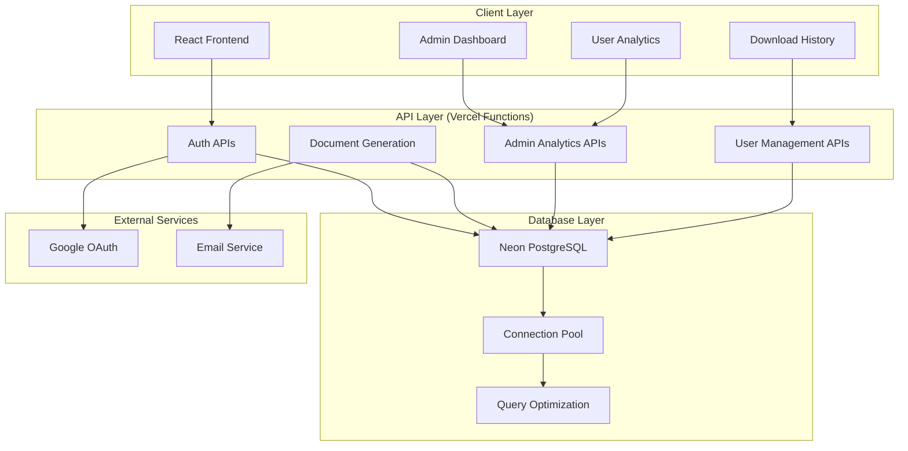
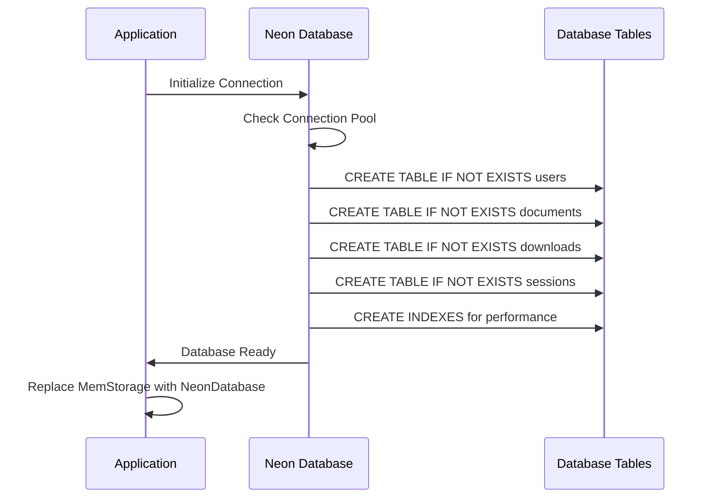
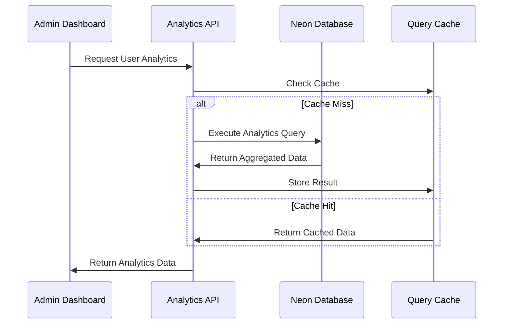

# Design Document

## Overview

This design implements a comprehensive database migration from the existing in-memory storage system to a persistent Neon PostgreSQL database with advanced analytics capabilities. The system will replace the current `server/storage.ts` implementation while maintaining full backward compatibility with existing APIs. The design includes robust connection pooling, automatic table creation, comprehensive analytics endpoints, and optimized performance for Vercel's serverless environment.

## Architecture

### High-Level Architecture



### Database Migration Flow



### Analytics Data Flow



## Components and Interfaces

### 1. Enhanced Neon Database Class

**Location**: `api/_lib/neon-database.ts`

```typescript
interface NeonDatabaseInterface {
  // Connection Management
  initialize(): Promise<void>;
  testConnection(): Promise<boolean>;
  getConnectionStatus(): Promise<ConnectionStatus>;
  
  // User Operations (Enhanced)
  createOrUpdateUser(userData: GoogleUserData): Promise<User>;
  getUserById(id: string): Promise<User | null>;
  getUserByGoogleId(googleId: string): Promise<User | null>;
  getUserByEmail(email: string): Promise<User | null>;
  getAllUsers(pagination?: PaginationOptions): Promise<PaginatedUsers>;
  updateUserPreferences(userId: string, preferences: UserPreferences): Promise<User>;
  deactivateUser(userId: string): Promise<boolean>;
  
  // Document Operations (New)
  createDocument(documentData: DocumentCreateData): Promise<Document>;
  getDocumentById(id: string): Promise<Document | null>;
  getUserDocuments(userId: string, pagination?: PaginationOptions): Promise<PaginatedDocuments>;
  getAllDocuments(pagination?: PaginationOptions): Promise<PaginatedDocuments>;
  updateDocument(id: string, updates: DocumentUpdateData): Promise<Document | null>;
  deleteDocument(id: string): Promise<boolean>;
  
  // Download Operations (Enhanced)
  recordDownload(downloadData: DownloadCreateData): Promise<Download>;
  getUserDownloads(userId: string, pagination?: PaginationOptions): Promise<PaginatedDownloads>;
  getAllDownloads(pagination?: PaginationOptions): Promise<PaginatedDownloads>;
  updateDownloadStatus(id: string, status: DownloadStatus, emailData?: EmailStatusData): Promise<void>;
  getDownloadById(id: string): Promise<Download | null>;
  
  // Analytics Operations (New)
  getUserAnalytics(dateRange?: DateRange): Promise<UserAnalytics>;
  getDocumentAnalytics(dateRange?: DateRange): Promise<DocumentAnalytics>;
  getDownloadAnalytics(dateRange?: DateRange): Promise<DownloadAnalytics>;
  getSystemHealthMetrics(): Promise<SystemHealthMetrics>;
  getUserGrowthTrends(period: 'daily' | 'weekly' | 'monthly'): Promise<GrowthTrend[]>;
  getDownloadTrends(period: 'daily' | 'weekly' | 'monthly'): Promise<DownloadTrend[]>;
  
  // Session Management (Enhanced)
  createSession(sessionData: SessionCreateData): Promise<UserSession>;
  getSession(sessionId: string): Promise<UserSession | null>;
  validateSession(sessionId: string): Promise<User | null>;
  updateSessionActivity(sessionId: string): Promise<void>;
  deleteSession(sessionId: string): Promise<boolean>;
  deleteUserSessions(userId: string): Promise<boolean>;
  getActiveSessions(): Promise<ActiveSessionMetrics>;
}
```

### 2. Admin Analytics API Endpoints

**Location**: `api/admin/analytics/`

#### User Analytics API (`users.ts`)
```typescript
interface UserAnalyticsAPI {
  '/api/admin/analytics/users': {
    GET: {
      query?: {
        dateRange?: string; // '7d', '30d', '90d', 'custom'
        startDate?: string;
        endDate?: string;
      };
      response: UserAnalyticsResponse;
    };
  };
}

interface UserAnalyticsResponse {
  success: boolean;
  data: {
    totalUsers: number;
    activeUsers: number;
    newUsersToday: number;
    newUsers7d: number;
    newUsers30d: number;
    userGrowthRate: number;
    averageSessionDuration: number;
    topUsersByActivity: UserActivitySummary[];
    userRegistrationTrends: TrendDataPoint[];
    userActivityTrends: TrendDataPoint[];
  };
  metadata: {
    generatedAt: string;
    dateRange: DateRange;
    cacheStatus: 'hit' | 'miss';
  };
}
```

#### Document Analytics API (`documents.ts`)
```typescript
interface DocumentAnalyticsAPI {
  '/api/admin/analytics/documents': {
    GET: {
      query?: {
        dateRange?: string;
        startDate?: string;
        endDate?: string;
      };
      response: DocumentAnalyticsResponse;
    };
  };
}

interface DocumentAnalyticsResponse {
  success: boolean;
  data: {
    totalDocuments: number;
    documentsToday: number;
    documents7d: number;
    documents30d: number;
    averageDocumentSize: number;
    averageGenerationTime: number;
    documentCreationTrends: TrendDataPoint[];
    popularDocumentTypes: DocumentTypeSummary[];
    documentsByUser: DocumentUserSummary[];
  };
  metadata: {
    generatedAt: string;
    dateRange: DateRange;
    cacheStatus: 'hit' | 'miss';
  };
}
```

#### Download Analytics API (`downloads.ts`)
```typescript
interface DownloadAnalyticsAPI {
  '/api/admin/analytics/downloads': {
    GET: {
      query?: {
        dateRange?: string;
        startDate?: string;
        endDate?: string;
        format?: 'pdf' | 'docx' | 'all';
      };
      response: DownloadAnalyticsResponse;
    };
  };
}

interface DownloadAnalyticsResponse {
  success: boolean;
  data: {
    totalDownloads: number;
    downloadsToday: number;
    downloads7d: number;
    downloads30d: number;
    downloadsByFormat: FormatBreakdown;
    averageFileSize: number;
    totalDataTransferred: number;
    downloadTrends: TrendDataPoint[];
    topDownloadedDocuments: DocumentDownloadSummary[];
    downloadsByTimeOfDay: HourlyBreakdown[];
    downloadsByDayOfWeek: DailyBreakdown[];
  };
  metadata: {
    generatedAt: string;
    dateRange: DateRange;
    cacheStatus: 'hit' | 'miss';
  };
}
```

#### System Health API (`system.ts`)
```typescript
interface SystemHealthAPI {
  '/api/admin/analytics/system': {
    GET: {
      response: SystemHealthResponse;
    };
  };
}

interface SystemHealthResponse {
  success: boolean;
  data: {
    databaseStatus: 'healthy' | 'degraded' | 'down';
    connectionPoolStatus: ConnectionPoolMetrics;
    activeConnections: number;
    queryPerformance: QueryPerformanceMetrics;
    errorRates: ErrorRateMetrics;
    systemUptime: number;
    memoryUsage: MemoryMetrics;
    responseTimeMetrics: ResponseTimeMetrics;
    recentErrors: SystemError[];
  };
  metadata: {
    generatedAt: string;
    serverRegion: string;
    version: string;
  };
}
```

### 3. Database Schema Design

#### Users Table
```sql
CREATE TABLE users (
  id VARCHAR(255) PRIMARY KEY,
  google_id VARCHAR(255) UNIQUE NOT NULL,
  email VARCHAR(255) UNIQUE NOT NULL,
  name VARCHAR(255) NOT NULL,
  picture TEXT,
  created_at TIMESTAMP DEFAULT NOW(),
  updated_at TIMESTAMP DEFAULT NOW(),
  last_login_at TIMESTAMP DEFAULT NOW(),
  is_active BOOLEAN DEFAULT true,
  preferences JSONB DEFAULT '{"emailNotifications": true, "defaultExportFormat": "pdf", "theme": "light"}'::jsonb,
  
  -- Indexes
  INDEX idx_users_google_id (google_id),
  INDEX idx_users_email (email),
  INDEX idx_users_created_at (created_at),
  INDEX idx_users_last_login (last_login_at),
  INDEX idx_users_active (is_active)
);
```

#### Documents Table
```sql
CREATE TABLE documents (
  id VARCHAR(255) PRIMARY KEY,
  user_id VARCHAR(255) REFERENCES users(id) ON DELETE CASCADE,
  title VARCHAR(500) NOT NULL,
  content JSONB NOT NULL,
  document_type VARCHAR(50) DEFAULT 'ieee_paper',
  word_count INTEGER DEFAULT 0,
  page_count INTEGER DEFAULT 0,
  section_count INTEGER DEFAULT 0,
  figure_count INTEGER DEFAULT 0,
  reference_count INTEGER DEFAULT 0,
  created_at TIMESTAMP DEFAULT NOW(),
  updated_at TIMESTAMP DEFAULT NOW(),
  
  -- Indexes
  INDEX idx_documents_user_id (user_id),
  INDEX idx_documents_created_at (created_at),
  INDEX idx_documents_type (document_type),
  INDEX idx_documents_title (title)
);
```

#### Downloads Table
```sql
CREATE TABLE downloads (
  id VARCHAR(255) PRIMARY KEY,
  user_id VARCHAR(255) REFERENCES users(id) ON DELETE CASCADE,
  document_id VARCHAR(255) REFERENCES documents(id) ON DELETE SET NULL,
  document_title VARCHAR(500) NOT NULL,
  file_format VARCHAR(10) NOT NULL,
  file_size INTEGER DEFAULT 0,
  downloaded_at TIMESTAMP DEFAULT NOW(),
  ip_address VARCHAR(45),
  user_agent TEXT,
  status VARCHAR(20) DEFAULT 'completed',
  email_sent BOOLEAN DEFAULT false,
  email_sent_at TIMESTAMP,
  email_error TEXT,
  document_metadata JSONB DEFAULT '{}'::jsonb,
  generation_time_ms INTEGER DEFAULT 0,
  
  -- Indexes
  INDEX idx_downloads_user_id (user_id),
  INDEX idx_downloads_document_id (document_id),
  INDEX idx_downloads_downloaded_at (downloaded_at),
  INDEX idx_downloads_format (file_format),
  INDEX idx_downloads_status (status),
  INDEX idx_downloads_date_format (downloaded_at, file_format)
);
```

#### Sessions Table
```sql
CREATE TABLE user_sessions (
  session_id VARCHAR(255) PRIMARY KEY,
  user_id VARCHAR(255) REFERENCES users(id) ON DELETE CASCADE,
  created_at TIMESTAMP DEFAULT NOW(),
  expires_at TIMESTAMP NOT NULL,
  last_accessed_at TIMESTAMP DEFAULT NOW(),
  is_active BOOLEAN DEFAULT true,
  ip_address VARCHAR(45),
  user_agent TEXT,
  
  -- Indexes
  INDEX idx_sessions_user_id (user_id),
  INDEX idx_sessions_expires_at (expires_at),
  INDEX idx_sessions_active (is_active),
  INDEX idx_sessions_last_accessed (last_accessed_at)
);
```

## Data Models

### Enhanced User Model
```typescript
interface User {
  id: string;
  google_id: string;
  email: string;
  name: string;
  picture?: string;
  created_at: string;
  updated_at: string;
  last_login_at: string;
  is_active: boolean;
  preferences: UserPreferences;
  
  // Computed fields (from joins/aggregations)
  total_documents?: number;
  total_downloads?: number;
  last_document_created?: string;
  last_download?: string;
}

interface UserPreferences {
  emailNotifications: boolean;
  defaultExportFormat: 'pdf' | 'docx';
  theme: 'light' | 'dark';
  language?: string;
  timezone?: string;
}
```

### Document Model
```typescript
interface Document {
  id: string;
  user_id: string;
  title: string;
  content: DocumentContent;
  document_type: string;
  word_count: number;
  page_count: number;
  section_count: number;
  figure_count: number;
  reference_count: number;
  created_at: string;
  updated_at: string;
  
  // Computed fields
  user_name?: string;
  user_email?: string;
  download_count?: number;
  last_downloaded?: string;
}

interface DocumentContent {
  title: string;
  abstract?: string;
  keywords?: string;
  authors: Author[];
  sections: Section[];
  references: Reference[];
  figures: Figure[];
  settings: DocumentSettings;
}
```

### Enhanced Download Model
```typescript
interface Download {
  id: string;
  user_id: string;
  document_id?: string;
  document_title: string;
  file_format: 'pdf' | 'docx';
  file_size: number;
  downloaded_at: string;
  ip_address?: string;
  user_agent?: string;
  status: 'pending' | 'completed' | 'failed' | 'expired';
  email_sent: boolean;
  email_sent_at?: string;
  email_error?: string;
  document_metadata: DocumentMetadata;
  generation_time_ms: number;
  
  // Computed fields
  user_name?: string;
  user_email?: string;
  document_exists?: boolean;
}

interface DocumentMetadata {
  pageCount: number;
  wordCount: number;
  sectionCount: number;
  figureCount: number;
  referenceCount: number;
  generationTime: number;
  fileSize: number;
  format: string;
}
```

### Analytics Models
```typescript
interface UserAnalytics {
  totalUsers: number;
  activeUsers: number;
  newUsersToday: number;
  newUsers7d: number;
  newUsers30d: number;
  userGrowthRate: number;
  averageSessionDuration: number;
  topUsersByActivity: UserActivitySummary[];
  userRegistrationTrends: TrendDataPoint[];
  userActivityTrends: TrendDataPoint[];
}

interface DocumentAnalytics {
  totalDocuments: number;
  documentsToday: number;
  documents7d: number;
  documents30d: number;
  averageDocumentSize: number;
  averageGenerationTime: number;
  documentCreationTrends: TrendDataPoint[];
  popularDocumentTypes: DocumentTypeSummary[];
  documentsByUser: DocumentUserSummary[];
}

interface DownloadAnalytics {
  totalDownloads: number;
  downloadsToday: number;
  downloads7d: number;
  downloads30d: number;
  downloadsByFormat: FormatBreakdown;
  averageFileSize: number;
  totalDataTransferred: number;
  downloadTrends: TrendDataPoint[];
  topDownloadedDocuments: DocumentDownloadSummary[];
  downloadsByTimeOfDay: HourlyBreakdown[];
  downloadsByDayOfWeek: DailyBreakdown[];
}

interface SystemHealthMetrics {
  databaseStatus: 'healthy' | 'degraded' | 'down';
  connectionPoolStatus: ConnectionPoolMetrics;
  activeConnections: number;
  queryPerformance: QueryPerformanceMetrics;
  errorRates: ErrorRateMetrics;
  systemUptime: number;
  memoryUsage: MemoryMetrics;
  responseTimeMetrics: ResponseTimeMetrics;
  recentErrors: SystemError[];
}
```

## Error Handling

### Database Connection Errors
```typescript
enum DatabaseErrorCodes {
  CONNECTION_FAILED = 'DB_CONNECTION_FAILED',
  QUERY_TIMEOUT = 'DB_QUERY_TIMEOUT',
  CONSTRAINT_VIOLATION = 'DB_CONSTRAINT_VIOLATION',
  TABLE_NOT_FOUND = 'DB_TABLE_NOT_FOUND',
  PERMISSION_DENIED = 'DB_PERMISSION_DENIED',
  CONNECTION_POOL_EXHAUSTED = 'DB_POOL_EXHAUSTED'
}

interface DatabaseError {
  code: DatabaseErrorCodes;
  message: string;
  query?: string;
  params?: any[];
  originalError?: Error;
  timestamp: string;
  severity: 'low' | 'medium' | 'high' | 'critical';
}
```

### Migration Errors
```typescript
enum MigrationErrorCodes {
  SCHEMA_MISMATCH = 'MIGRATION_SCHEMA_MISMATCH',
  DATA_CORRUPTION = 'MIGRATION_DATA_CORRUPTION',
  ROLLBACK_FAILED = 'MIGRATION_ROLLBACK_FAILED',
  BACKUP_FAILED = 'MIGRATION_BACKUP_FAILED'
}
```

### Error Recovery Strategies
1. **Connection Failures**: Implement exponential backoff retry logic
2. **Query Timeouts**: Optimize queries and implement query splitting
3. **Pool Exhaustion**: Implement connection queuing and monitoring
4. **Data Integrity**: Use transactions and constraint validation
5. **Migration Issues**: Implement rollback mechanisms and data validation

## Performance Optimization

### Query Optimization
1. **Indexing Strategy**:
   - Primary indexes on frequently queried columns
   - Composite indexes for complex queries
   - Partial indexes for filtered queries
   - Full-text search indexes for content

2. **Query Patterns**:
   - Use prepared statements for repeated queries
   - Implement query result caching
   - Use pagination for large result sets
   - Optimize JOIN operations

3. **Analytics Queries**:
   - Pre-aggregate common metrics
   - Use materialized views for complex calculations
   - Implement time-based partitioning
   - Cache analytics results with TTL

### Connection Management
```typescript
interface ConnectionPoolConfig {
  maxConnections: number;
  minConnections: number;
  acquireTimeoutMillis: number;
  idleTimeoutMillis: number;
  reapIntervalMillis: number;
  createRetryIntervalMillis: number;
  createTimeoutMillis: number;
}

const VERCEL_OPTIMIZED_CONFIG: ConnectionPoolConfig = {
  maxConnections: 10,
  minConnections: 2,
  acquireTimeoutMillis: 30000,
  idleTimeoutMillis: 300000,
  reapIntervalMillis: 1000,
  createRetryIntervalMillis: 200,
  createTimeoutMillis: 30000
};
```

### Caching Strategy
1. **Query Result Caching**:
   - Cache analytics queries for 5-15 minutes
   - Cache user profile data for 1 hour
   - Cache system health metrics for 1 minute

2. **Application-Level Caching**:
   - Use in-memory cache for frequently accessed data
   - Implement cache invalidation strategies
   - Use Redis for distributed caching (future enhancement)

## Security Considerations

### Data Protection
1. **Encryption**:
   - Encrypt sensitive data at rest
   - Use TLS for all database connections
   - Implement field-level encryption for PII

2. **Access Control**:
   - Implement role-based access control
   - Use database user permissions
   - Audit all database access

3. **SQL Injection Prevention**:
   - Use parameterized queries exclusively
   - Validate all input data
   - Implement query whitelisting

### Privacy Compliance
1. **Data Retention**:
   - Implement automatic data purging
   - Provide user data export functionality
   - Support right to be forgotten (GDPR)

2. **Audit Logging**:
   - Log all data access and modifications
   - Implement audit trail for sensitive operations
   - Monitor for suspicious activity

## Testing Strategy

### Unit Tests
1. **Database Operations**:
   - Test all CRUD operations
   - Test connection handling
   - Test error scenarios
   - Test data validation

2. **Analytics Functions**:
   - Test calculation accuracy
   - Test date range handling
   - Test aggregation functions
   - Test performance under load

### Integration Tests
1. **API Endpoints**:
   - Test complete request/response cycles
   - Test authentication integration
   - Test error handling
   - Test rate limiting

2. **Database Migration**:
   - Test schema creation
   - Test data migration
   - Test rollback procedures
   - Test performance impact

### Performance Tests
1. **Load Testing**:
   - Test concurrent user scenarios
   - Test database connection limits
   - Test query performance under load
   - Test memory usage patterns

2. **Stress Testing**:
   - Test system behavior at limits
   - Test recovery from failures
   - Test data consistency under stress
   - Test connection pool behavior

## Deployment Considerations

### Environment Configuration
```typescript
interface DatabaseConfig {
  DATABASE_URL: string;
  DATABASE_POOL_SIZE: number;
  DATABASE_TIMEOUT: number;
  ANALYTICS_CACHE_TTL: number;
  ENABLE_QUERY_LOGGING: boolean;
  ENABLE_PERFORMANCE_MONITORING: boolean;
}
```

### Migration Strategy
1. **Phase 1**: Deploy new database layer alongside existing storage
2. **Phase 2**: Migrate read operations to database
3. **Phase 3**: Migrate write operations to database
4. **Phase 4**: Remove old storage system
5. **Phase 5**: Optimize and monitor performance

### Monitoring and Alerting
1. **Database Metrics**:
   - Connection pool utilization
   - Query performance
   - Error rates
   - Data growth

2. **Application Metrics**:
   - API response times
   - User activity patterns
   - System resource usage
   - Error frequencies

3. **Alerting Rules**:
   - Database connection failures
   - Query timeout increases
   - High error rates
   - Performance degradation

## Backward Compatibility

### API Compatibility
- All existing API endpoints maintain the same request/response formats
- Session management continues to work with existing client code
- Error responses maintain consistent structure
- Authentication flow remains unchanged

### Data Migration
- Existing in-memory data structures are preserved in database schema
- All existing functionality continues to work during migration
- Gradual migration approach minimizes disruption
- Rollback capability ensures system stability

### Client Integration
- No changes required to existing client code
- Admin dashboard receives enhanced analytics without breaking changes
- User authentication and session management remain transparent
- Download tracking continues seamlessly