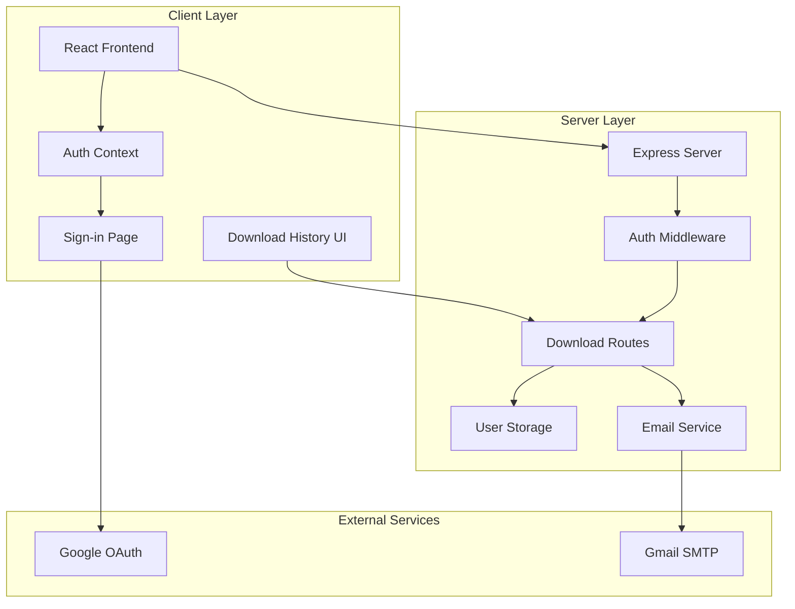
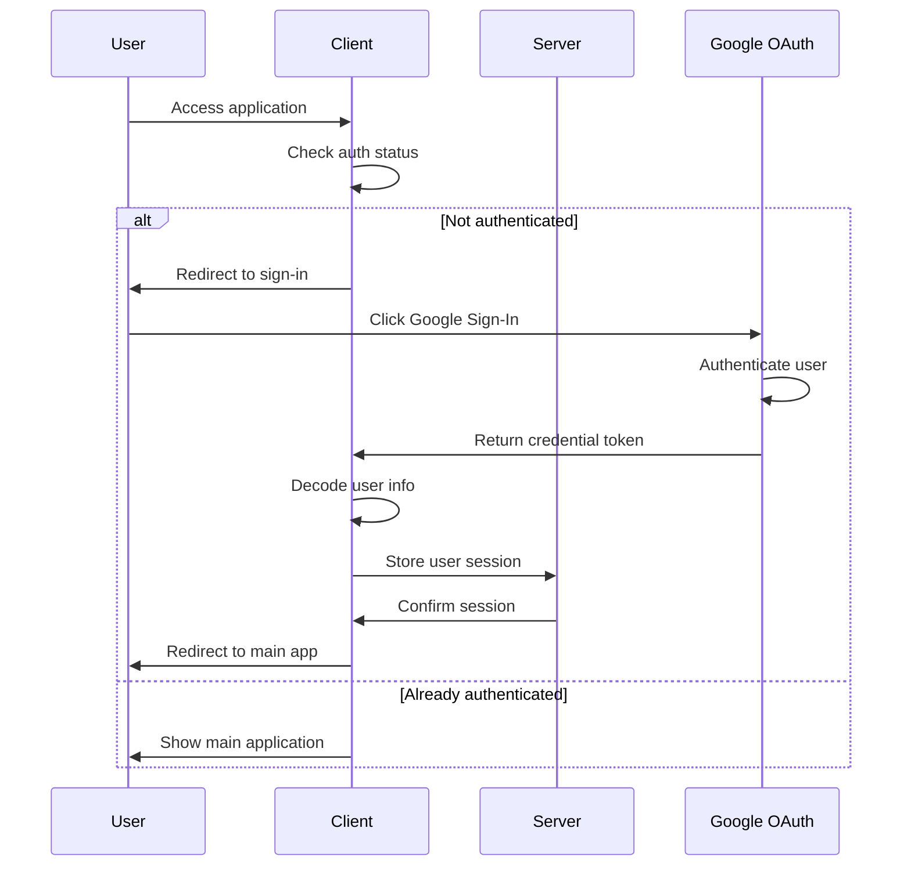
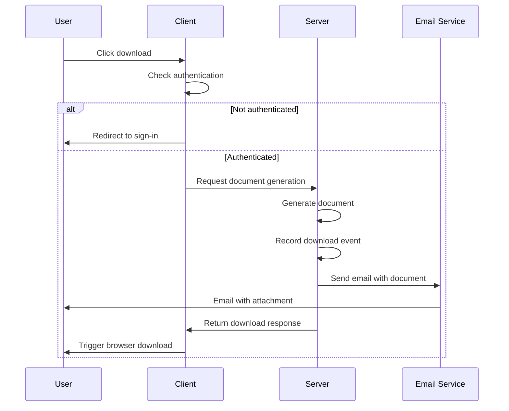

# Design Document

## Overview

This design implements a comprehensive user authentication and download tracking system for Format-A. The system integrates Google OAuth for secure authentication, tracks all user downloads with detailed metadata, maintains download history, and automatically sends generated documents via email. The design leverages the existing email service infrastructure and extends the current storage system to support user management and download tracking.

## Architecture

### High-Level Architecture



### Authentication Flow



### Download Flow with Tracking



## Components and Interfaces

### 1. Authentication Context (Client)

**Location**: `client/src/contexts/auth-context.tsx`

```typescript
interface User {
  id: string;
  name: string;
  email: string;
  picture: string;
  googleId: string;
  createdAt: string;
}

interface AuthContextType {
  user: User | null;
  setUser: (user: User | null) => void;
  signOut: () => void;
  isAuthenticated: boolean;
}
```

**Responsibilities**:
- Manage user authentication state
- Provide user information across the application
- Handle sign-out functionality
- Persist authentication state in localStorage

### 2. Authentication Middleware (Server)

**Location**: `server/middleware/auth.ts`

```typescript
interface AuthMiddleware {
  requireAuth: (req: Request, res: Response, next: NextFunction) => void;
  optionalAuth: (req: Request, res: Response, next: NextFunction) => void;
  extractUser: (req: Request) => User | null;
}
```

**Responsibilities**:
- Validate user sessions
- Extract user information from requests
- Protect download endpoints
- Handle authentication errors

### 3. User Storage Service (Server)

**Location**: `server/storage/user-storage.ts`

```typescript
interface UserStorage {
  createUser(userData: GoogleUserData): Promise<User>;
  getUserById(id: string): Promise<User | null>;
  getUserByEmail(email: string): Promise<User | null>;
  getUserByGoogleId(googleId: string): Promise<User | null>;
  updateUser(id: string, updates: Partial<User>): Promise<User | null>;
  deleteUser(id: string): Promise<boolean>;
}
```

### 4. Download Tracking Service (Server)

**Location**: `server/storage/download-storage.ts`

```typescript
interface DownloadStorage {
  recordDownload(download: DownloadRecord): Promise<DownloadRecord>;
  getUserDownloads(userId: string, pagination?: PaginationOptions): Promise<PaginatedDownloads>;
  getDownloadById(id: string): Promise<DownloadRecord | null>;
  updateDownloadStatus(id: string, status: DownloadStatus): Promise<void>;
  deleteUserDownloads(userId: string): Promise<boolean>;
}
```

### 5. Download History Component (Client)

**Location**: `client/src/components/download-history.tsx`

```typescript
interface DownloadHistoryProps {
  userId: string;
}

interface DownloadHistoryState {
  downloads: DownloadRecord[];
  loading: boolean;
  pagination: PaginationInfo;
}
```

**Responsibilities**:
- Display user's download history
- Handle pagination
- Allow re-downloading of previous documents
- Show download status and metadata

### 6. Protected Download Routes (Server)

**Location**: `server/routes/protected-downloads.ts`

```typescript
interface ProtectedDownloadRoutes {
  '/api/download/docx': (req: AuthenticatedRequest, res: Response) => Promise<void>;
  '/api/download/pdf': (req: AuthenticatedRequest, res: Response) => Promise<void>;
  '/api/downloads/history': (req: AuthenticatedRequest, res: Response) => Promise<void>;
  '/api/downloads/:id/redownload': (req: AuthenticatedRequest, res: Response) => Promise<void>;
}
```

## Data Models

### User Model

```typescript
interface User {
  id: string;                    // UUID
  googleId: string;              // Google OAuth ID
  email: string;                 // Primary email from Google
  name: string;                  // Display name from Google
  picture: string;               // Profile picture URL from Google
  createdAt: string;             // ISO timestamp
  updatedAt: string;             // ISO timestamp
  lastLoginAt: string;           // ISO timestamp
  isActive: boolean;             // Account status
  preferences: UserPreferences;   // User settings
}

interface UserPreferences {
  emailNotifications: boolean;
  defaultExportFormat: 'docx' | 'pdf';
  theme: 'light' | 'dark';
}
```

### Download Record Model

```typescript
interface DownloadRecord {
  id: string;                    // UUID
  userId: string;                // Foreign key to User
  documentId: string;            // Reference to generated document
  documentTitle: string;         // Document title for display
  fileFormat: 'docx' | 'pdf';   // Export format
  fileSize: number;              // File size in bytes
  downloadedAt: string;          // ISO timestamp
  ipAddress: string;             // User's IP address
  userAgent: string;             // Browser/client info
  status: DownloadStatus;        // Download status
  emailSent: boolean;            // Email delivery status
  emailSentAt?: string;          // Email sent timestamp
  emailError?: string;           // Email error if failed
  documentMetadata: DocumentMetadata; // Document details
}

type DownloadStatus = 'pending' | 'completed' | 'failed' | 'expired';

interface DocumentMetadata {
  pageCount: number;
  wordCount: number;
  sectionCount: number;
  figureCount: number;
  referenceCount: number;
  generationTime: number;        // Time taken to generate (ms)
}
```

### Session Model

```typescript
interface UserSession {
  sessionId: string;             // UUID
  userId: string;                // Foreign key to User
  createdAt: string;             // ISO timestamp
  expiresAt: string;             // ISO timestamp
  isActive: boolean;             // Session status
  lastAccessedAt: string;        // ISO timestamp
  ipAddress: string;             // Session IP
  userAgent: string;             // Browser info
}
```

## Error Handling

### Authentication Errors

```typescript
enum AuthErrorCodes {
  INVALID_TOKEN = 'INVALID_TOKEN',
  EXPIRED_SESSION = 'EXPIRED_SESSION',
  GOOGLE_AUTH_FAILED = 'GOOGLE_AUTH_FAILED',
  USER_NOT_FOUND = 'USER_NOT_FOUND',
  SESSION_EXPIRED = 'SESSION_EXPIRED'
}

interface AuthError {
  code: AuthErrorCodes;
  message: string;
  details?: any;
}
```

### Download Errors

```typescript
enum DownloadErrorCodes {
  AUTHENTICATION_REQUIRED = 'AUTHENTICATION_REQUIRED',
  DOCUMENT_GENERATION_FAILED = 'DOCUMENT_GENERATION_FAILED',
  EMAIL_DELIVERY_FAILED = 'EMAIL_DELIVERY_FAILED',
  DOWNLOAD_LIMIT_EXCEEDED = 'DOWNLOAD_LIMIT_EXCEEDED',
  INVALID_DOCUMENT_DATA = 'INVALID_DOCUMENT_DATA'
}
```

### Error Response Format

```typescript
interface ErrorResponse {
  success: false;
  error: {
    code: string;
    message: string;
    details?: any;
  };
  timestamp: string;
  requestId: string;
}
```

## Security Considerations

### Authentication Security

1. **Google OAuth Integration**:
   - Use secure OAuth 2.0 flow
   - Validate Google JWT tokens
   - Store minimal user data from Google

2. **Session Management**:
   - Generate secure session tokens
   - Implement session expiration
   - Clear sessions on sign-out

3. **Data Protection**:
   - Encrypt sensitive user data
   - Use HTTPS for all communications
   - Implement CORS properly

### Download Security

1. **Access Control**:
   - Require authentication for all downloads
   - Validate user ownership of downloads
   - Implement rate limiting

2. **Data Privacy**:
   - Store download metadata securely
   - Allow users to delete their data
   - Comply with privacy regulations

## Testing Strategy

### Unit Tests

1. **Authentication Components**:
   - Auth context state management
   - Google OAuth token validation
   - Session management functions

2. **Storage Services**:
   - User CRUD operations
   - Download tracking functions
   - Data validation and sanitization

3. **API Endpoints**:
   - Authentication middleware
   - Protected route access
   - Error handling scenarios

### Integration Tests

1. **Authentication Flow**:
   - Complete Google OAuth flow
   - Session creation and validation
   - Sign-out process

2. **Download Flow**:
   - Authenticated document generation
   - Download tracking and storage
   - Email delivery integration

3. **Error Scenarios**:
   - Unauthenticated access attempts
   - Invalid session handling
   - Email delivery failures

### End-to-End Tests

1. **User Journey Tests**:
   - Sign-in to download flow
   - Download history access
   - Re-download functionality

2. **Cross-Browser Testing**:
   - Google OAuth compatibility
   - Download functionality
   - UI responsiveness

## Performance Considerations

### Database Optimization

1. **Indexing Strategy**:
   - Index user emails and Google IDs
   - Index download timestamps
   - Composite indexes for queries

2. **Query Optimization**:
   - Paginate download history
   - Use efficient joins
   - Cache frequently accessed data

### Caching Strategy

1. **User Session Caching**:
   - Cache active sessions in memory
   - Implement session cleanup
   - Use Redis for distributed caching

2. **Download Metadata Caching**:
   - Cache recent download records
   - Implement cache invalidation
   - Use appropriate TTL values

## Deployment Considerations

### Environment Configuration

```typescript
interface AuthConfig {
  GOOGLE_CLIENT_ID: string;
  GOOGLE_CLIENT_SECRET: string;
  SESSION_SECRET: string;
  JWT_SECRET: string;
  COOKIE_DOMAIN: string;
  SECURE_COOKIES: boolean;
}
```

### Database Migration

1. **User Table Creation**:
   - Create users table with proper constraints
   - Set up indexes for performance
   - Add foreign key relationships

2. **Download Tracking Tables**:
   - Create downloads table
   - Create sessions table
   - Set up proper relationships

### Monitoring and Logging

1. **Authentication Metrics**:
   - Track sign-in success/failure rates
   - Monitor session duration
   - Alert on authentication anomalies

2. **Download Metrics**:
   - Track download volume and patterns
   - Monitor email delivery success
   - Alert on system failures